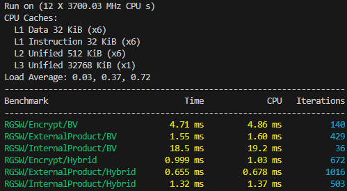

# (Somewhat) Practical Anonymous Routing with Homomorphic Encryption

Many anonymous communication systems have been proposed and implemented with the goal of allowing users to exchange messages over a network without revealing who is communicating with whom. Most of these designs (e.g., Tor, I2P, mixnets) rely on the _threshold model_ to provide anonymity, wherein some components of their infrastructure must be behaving honestly. Systems with stronger anonymity guarantees (e.g., DC-nets) generally suffer from poor scalability or are impractical to instantiate.

This thesis examines a new construction called a (Somewhat) Practical Anonymous Router ([https://eprint.iacr.org/2025/860](https://eprint.iacr.org/2025/860)), which addresses the trust and practicality concerns of existing systems. The construction relies only on well-established FHE schemes, making it realistically implementable. While sPAR presents a promising new avenue for constructing anonymous communication systems, it remains a theoretical construction. A concrete implementation and a deeper investigation is therefore needed to evaluate its practical performance and viability in larger networks.

In an effort to investigate sPAR's viability, this thesis aims to implement the scheme in C++ using OpenFHE and conduct a structured evaluation of its performance with respect to the number of participants in the system. 

__Research Questions:__
* What is the computational cost of sPAR, and how does it compare to the theoretical complexity described in the original paper?
* How does the performance of sPAR scale with the number of participants, and at what point does it become impractical?


## Table of Contents
<ul>
    <li><a href="#build-instructions">Build Instructions</a></li>
    <!-- <li><a href="#project-layout">Project Layout</a></li> -->
    <li><a href="#unit-tests">Unit Tests</a></li>
    <li><a href="#benchmarks">Benchmarks</a></li>
    <!-- <li><a href="#results">Benchmarks</a></li> -->
</ul>


## Build Instructions

1. Clone the repo `git clone git@github.com:ImreAngelo/fhe-master-thesis.git` 
2. Initialize submodules recursively `git submodule update --init --recursive`
3. Run `make build` to build OpenFHE and the project
4. Profit

<!-- TODO: -->
> [!NOTE] 
> The project will statically link OpenFHE by default. 
> To build the project using a version of OpenFHE already installed on the system, ... <!-- run `make build-dynamic` -->

<!-- ## Project Layout
TBD... -->


## Unit Tests
Unit tests are located inside the `tests` directory.
Configured with [Google Test](https://github.com/google/googletest).

> [!NOTE]
> Each test has a make target matching the file name in `test/src`
>
> ```sh
> make test             # run all tests
> make test-rgsw        # test rgsw operations
> make test-multiparty  # run protocol once
> ```

> [!TIP]
> Enable debug logging and timing by setting the debug environment variable
> ```sh
> DEBUG=1 make test
> ```

> [!TIP]
> [VSCode Extension for GoogleTest](https://github.com/matepek/vscode-catch2-test-adapter)

## Benchmarks
Benchmarks are located inside the `benchmark` directory.
Configured with [Google Benchmark](https://github.com/google/benchmark).

```sh
# Run the full benchmark suite
make bench
```

> [!TIP]
> Single benchmarks can be ran by overriding the `BENCH_NAMES` flag
> ``sh
> make -C benchmark run BENCH_NAMES=rgsw
> ``

| **Flag**          | **Description**                                                                                                 | **Default**            |
|-------------------|-----------------------------------------------------------------------------------------------------------------|------------------------|
| BENCH_REPETITIONS | Run tests multiple times to get additional statistics (median, standard deviation etc)                          | 1                      |
| BENCH_NAMES       | Specify benchmark files to run                                                                                  | All in `benchmark/src` |
| BENCH_FILTER      | Run only the benchmarks that match this filter                                                                  | .*                     |
| BENCH_TIME_UNIT   | Output times in this unit                                                                                       | ms                     |
| BENCH_OMP_THREADS | Limit the number of threads used by the program (note: the benchmark also runs multiple iterations in parallel) | 1                      |

<!-- TODO: Make smaller and center on page -->
<picture>
  <!-- <source
    width="100%"
    srcset="./docs/img/..-dark.avif"
    media="(prefers-color-scheme: dark)"
  />
  <source
    width="100%"
    srcset="./docs/img/..-light.avif"
    media="(prefers-color-scheme: light), (prefers-color-scheme: no-preference)"
  /> -->
  
</picture>

## TODO
- [ ] Add/verify support for BFV
- [ ] Test multi-threaded performance
